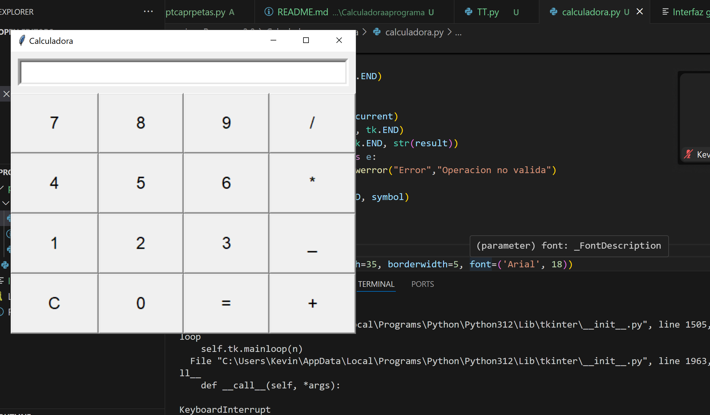

# INterfaz grafica Tkinter
En el presente directorio, se utilizo el modulotkinter para crear una interfaz grafica para un calculo
Tkinter es una biblioteca que se utiliza en el programa phynthon que se utiliza para crear unterfaces que le brinda al usuario un mayor comodidad y eficacia .

_Propietario_: Kevin Alvarado Bermudez

## Instrucciones de uso
?Que hay que tener instalado para ejecur=tar el programa ??Que comando utilizar?

tkinter 
py Calculadoraaprograma.py

## Demostracion de ejecucion

